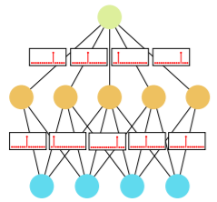
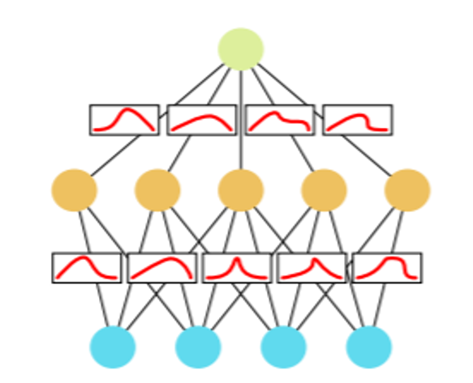

# Project-of-ECE884

## Introduction
Classifying medical images can be utilized in aiding clinical care and treatment and can reduce the diagnosis process's length significantly. In recent years,  Convolutional Neural Networks (CNNs) have been utilized for diagnosing diabetic retinopathy (DR) through analyzing fundus images and have proven their superiority in detection and classification tasks. In this project, we propose a novel deep CNN architecture that can classify subjects into 4 levels of disease severity;

<p align="center">
 <p>Beginner mens image</p>

</p>


## Prerequisites
### Packages
We use conda to set environment. In a new conda environment, required packages can be installed by 
  ```shell script
conda install python=3.9.2 tensorflow=2.4.1 pandas=1.2.3 
conda install tensorflow-probability=0.12.1 jupyterlab=3.0.12 -c conda-forge
```
### Datasets
The dataset can be downloaded from [here](https://www.kaggle.com/tanlikesmath/diabetic-retinopathy-resized).

## Usage 
First, you need to run `generate_data.py`, this will generate a dataset with each class have 700 samples.
Then, you can open the `model.ipynb` to train and test the model.

## Results and Discussion

## Reference
[1] Wen, Y., Vicol, P., Ba, J., Tran, D., & Grosse, R. (2018). Flipout: Efficient Pseudo-Independent Weight Perturbations on Mini-Batches. https://arxiv.org/abs/1803.04386

[2] Kwon, Y., Won, J. H., Kim, B. J., & Paik, M. C. (2020). Uncertainty quantification using Bayesian neural networks in classification: Application to biomedical imagesegmentation. Computational Statistics and Data Analysis, 142, 106816. https://doi.org/10.1016/j.csda.2019.106816

[3] J. Ker, L. Wang, J. Rao, and T. Lim. Deep learning applications in medical image analysis. IEEE Access, 6:9375–9389, 2018

[4] L. Jospin, W. Buntine, F. Bpussaid, H. Laga,  M.Bennamoun (2020). Hands-on Bayesian Neural Networks - a Tutorial for Deep Learning Users, arXiv:2007.06823v1
