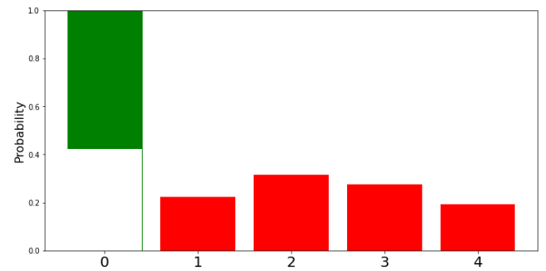
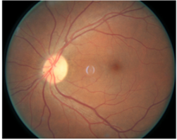

# Project-of-ECE884

## Introduction
Classifying medical images can be utilized in aiding clinical care and treatment and can reduce the diagnosis process's length significantly. In recent years,  Convolutional Neural Networks (CNNs) have been utilized for diagnosing diabetic retinopathy (DR) through analyzing fundus images and have proven their superiority in detection and classification tasks. In this project, we propose a novel deep CNN architecture that can classify subjects into 4 levels of disease severity;

<p align="center">


</p>

Adefinition for Bayesian neural networks is that they are stochastic artificial neural network trained using Bayesian inference [4]. As shown in the figures above, the differnce between traditional and bayesian nueral networks is the the values for the weights and biases, unlike in point estimates networks, these values in bayesian nets are probability distributions that we can sample from to generate a traditional neural network.

The main goal of using a bayesian neural network architecture is to get a better idea of the uncertainty associated with the underlying processes, which is very critical in medical fields since acting upon uncertain events as if they were certain may lead to catastrophic cosequences.


## Prerequisites
### Packages
We use conda to set environment. In a new conda environment, required packages can be installed by 
  ```shell script
conda install python=3.9.2 tensorflow=2.4.1 pandas=1.2.3 
conda install tensorflow-probability=0.12.1 jupyterlab=3.0.12 -c conda-forge
```
### Datasets
The dataset can be downloaded from [here](https://www.kaggle.com/tanlikesmath/diabetic-retinopathy-resized).

## Usage 
First, extract the dataset and download all the file in `code` into a same directory. It will looks like
  ```shell script
├── archive
│   ├── resized_train
│   ├── resized_train_cropped
│   ├── trainLabels_cropped.csv
│   └── trainLabels.csv
├── generate_data.py
└── model.ipynb
```
Then run `generate_data.py`, this will generate a dataset which has 700 samples in each classes.
After that, you can open the `model.ipynb` to train and test the model.


+ 	In this section we introduced 3 Bayesian models.
+	Bayesian Model 1 is a Bayesian by back prop model using the reparameterization trick the reparameterization trick is an approximative way in solving Bayesian function
+	Bayesian Model2 is another Bayesian by backprop methods that replaces the reparameterization trick/ reparameterization layers with the flipout layers. The flipout layers use Mont carol approximation to solve the Bayesian function.
+	One advantage of that method is its faster training time and more weights/ more degrees of freedom.
+	Bayesian Model 3 is an improvement over Bayesian model 2 with the training process with different layer shapes and different filter sizes. In this model we also preset categorical training, or how the model trains each class separately, and the effect hat has on the accuracy. 


## Results and Discussion
+ 	In this project we create a Bayesian neural network model to quantify the uncertainty in the diabetic retinopathy dataset. 
+	While traditional neural networks have shown promising performance in many classification problems, measuring and quantifying uncertainties have received less attention. 
+ 	The uncertainty will be expressed as a probability distribution. 
+ 	Calculating the uncertainty allows us to reduce the model’s dependence on unreliable images and therefore improving the model’s output. 

+ 	The first step is having a prior distribution P(w) over the model’s weights. 

+ 	Use Bayesian function to calculate the posterior P(w|D) 

+	Determining P(w|D) is computationally expensive therefore we need an approximation algorithm 

+	The variational inference process approximates the posterior P(w|D) with a second function referred to as the variational posterior q(w|theta) with theta being a tunable parameter. 

+	The difference between the true posterior and the variational posterior is measured by Kullback Liber divergence 

+	From the Kaulback divergence we can drive the loss function 

+	By minimizing the loss function we will be able to determine the parameter theta 

+ 	Variational inference is a good tool for solving the Bayesian function, but to adapt it more in this research we also used the Flipout estimator [1]
	+ The Flipout estimator is implemented using layers the Convolution2DFlipout and DenseFlipout layer available in tensorflow_probability
+ Variational inference can also be used along with Reparameterization trick or the reparameterization estimator 
	+ the reparameterization trick is equivalent to using the (Convolution2DReparameterization and DenseReparameterization) available in tensorflow_probability

+ finally we calculate the uncertainty  by using a method introduced in [2] Where the uncertainty is equivalent to the model’s variance of the prediction probability 

+ The figures below show the fundus eye images with the model’s prediction probability for the 5 classes 
+ The probability for each class is displayed as a distribution with a mean and variance ( this variance corelates to the uncertainty ( with higher variance equivalent to higher uncertainty)  
+ The variance can be decomposed to the two types of uncertainty Aleatoric and Epistemic based on the method proposed in [2]
	+ the aleatoric uncertainty represents the model’s inherent uncertainty and correlates to the quality of images available for training, with images with more noise introducing more aleatoric uncertainty.
		+ The Epistemic uncertainty on the other hand represents the model’s uncertainty in the data ( in other words if the model is not capable of distinguishing between classes epistemic uncertainty would be high, and generally higher number of images usually means lower epistemic uncertainty)  
+ The class that the model selects for the image is displayed in green.


<p align="center">


</p>

<p align="center">


</p>


## Reference
[1] Wen, Y., Vicol, P., Ba, J., Tran, D., & Grosse, R. (2018). Flipout: Efficient Pseudo-Independent Weight Perturbations on Mini-Batches. https://arxiv.org/abs/1803.04386

[2] Kwon, Y., Won, J. H., Kim, B. J., & Paik, M. C. (2020). Uncertainty quantification using Bayesian neural networks in classification: Application to biomedical imagesegmentation. Computational Statistics and Data Analysis, 142, 106816. https://doi.org/10.1016/j.csda.2019.106816

[3] J. Ker, L. Wang, J. Rao, and T. Lim. Deep learning applications in medical image analysis. IEEE Access, 6:9375–9389, 2018

[4] L. Jospin, W. Buntine, F. Bpussaid, H. Laga,  M.Bennamoun (2020). Hands-on Bayesian Neural Networks - a Tutorial for Deep Learning Users, arXiv:2007.06823v1
